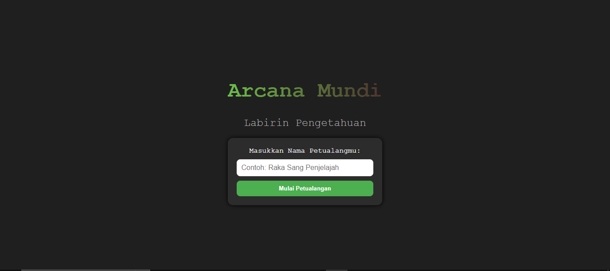
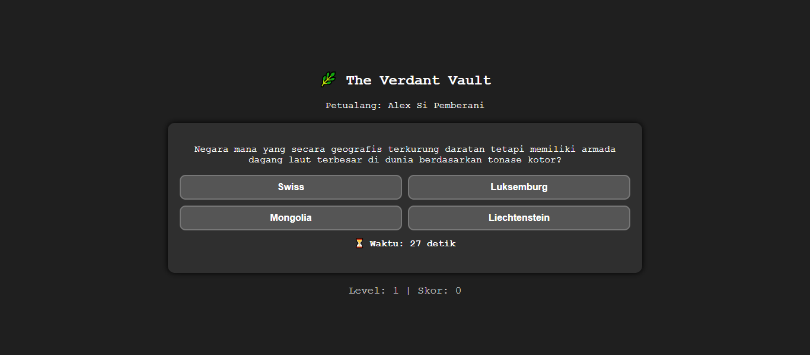

# Arcana Mundi 🏰📚

**Arcana Mundi** adalah game edukasi berbasis web yang menggabungkan atmosfer dungeon petualangan dengan kuis interaktif untuk mengasah pengetahuan. Mengusung desain pixel art, warna-warna tanah yang menenangkan, dan gameplay sederhana, Arcana Mundi mengajak pemain menelusuri dunia penuh teka-teki dan pengetahuan.

> 🚧 **Note**: Ini adalah versi prototype tanpa backend. Semua data disimpan secara lokal dan interaktivitas dibangun murni dengan HTML, CSS, dan JavaScript.

---

## 🎯 Visi Proyek

Arcana Mundi bertujuan menjadi lebih dari sekadar game kuis — ini adalah pengalaman belajar yang menyenangkan dan imersif, dirancang untuk:

- 🧠 Meningkatkan minat belajar melalui visual dan tantangan
- 🏞️ Menghadirkan atmosfer RPG dalam bentuk edukatif
- 📚 Menyediakan variasi topik pengetahuan untuk semua usia

---

## 🗺️ Struktur Halaman

- **Start Page**  
  Halaman utama dengan judul game dan form nama pemain.

- **Map Selection**  
  Pilihan dungeon bertema kategori soal:
  - The Verdant Vault 🌿 (Pengetahuan Umum)
  - The Cryptarithm Core 🔢 (Matematika)
  - The Blooming Grotto 🌸 (Biologi)
  - The Ether Spire ⚛️ (Fisika)

- **Question Interface**  
  Tiap dungeon memiliki pertanyaan bergaya kuis dengan opsi jawaban interaktif dan timer.

- **Feedback System**  
  Memberikan respon langsung apakah jawaban benar atau salah.

---

## 🎮 Interaktivitas & Visual

- ⏳ **Timer** untuk setiap soal
- 🧠 **Feedback langsung** untuk jawaban benar/salah
- ✨ **Animasi masuk** pada elemen halaman
- 🟩 **Tampilan tombol responsif dan interaktif**
- 📲 **Tampilan mobile-friendly** untuk pengalaman bermain di mana saja

---

## 🧱 Dibangun Dengan

- **HTML5** untuk struktur halaman  
- **CSS3** untuk desain pixel-art modern & layout responsif  
- **JavaScript** untuk logika kuis, kontrol tampilan, dan animasi

> Tidak menggunakan library eksternal — kode ringan dan mudah dikembangkan lebih lanjut.

---

## 📱 Responsif

- Dioptimalkan untuk mobile dan tablet
- Grid fleksibel dengan media queries
- Tombol besar dan mudah disentuh di layar kecil

---

## 🚀 Tujuan Proyek

- Menciptakan prototype **game edukasi dungeon-style**
- Menyajikan pengalaman belajar yang menyenangkan dan visual
- Menjadi dasar pengembangan platform pembelajaran gamifikasi ke depannya

---

## 🌐 Demo

[Arcana Mundi Live Demo](https://arcanamundi.vercel.app/)

---

## 👾 Author

Dibuat dengan 🎮 dan 💡 oleh [@zEntry6](https://github.com/zEntry6)
